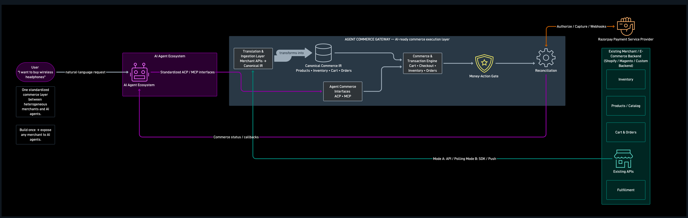
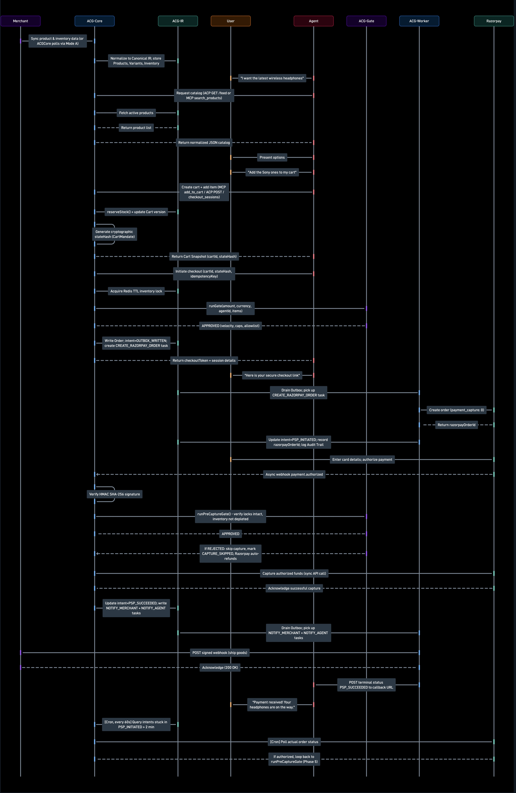
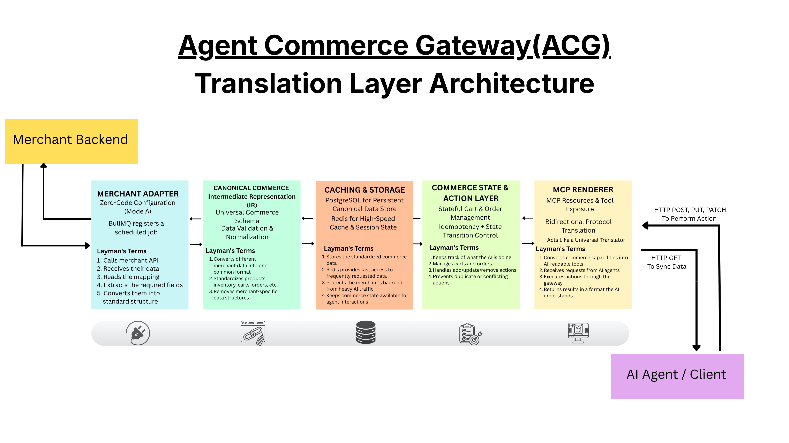
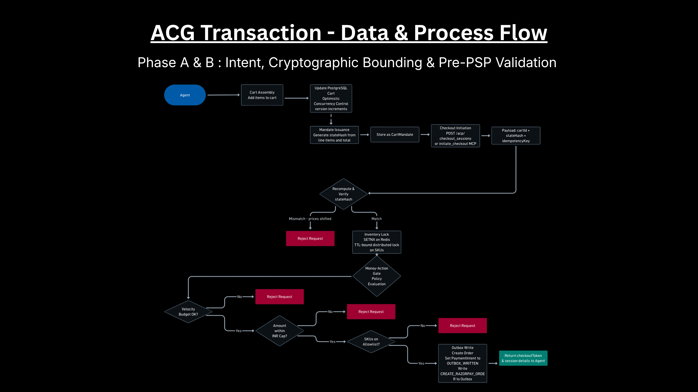
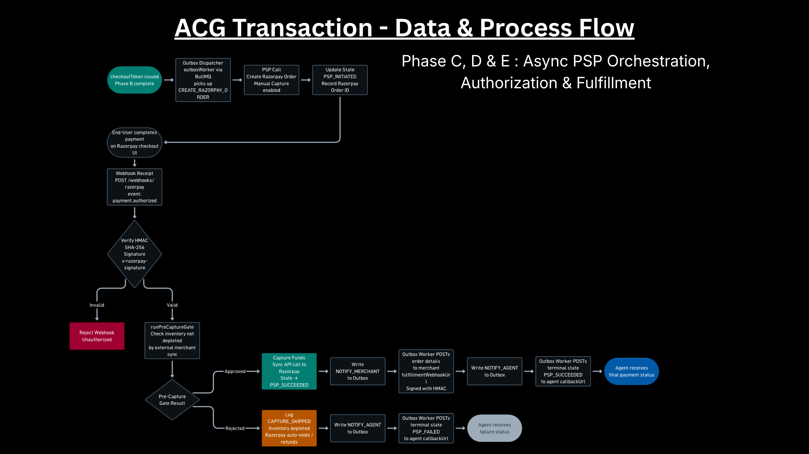
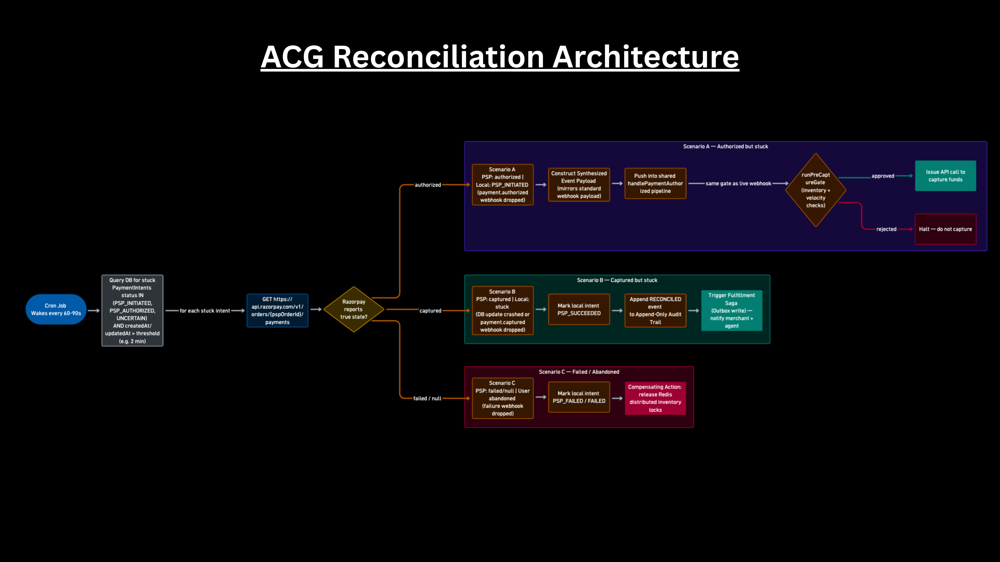

# Agent Commerce Gateway (ACG)

      

Agent Commerce Gateway connects merchant stores with autonomous AI agents securely. Today, AI agents have a hard time buying things safely because every merchant API is different. ACG fixes this by acting as a universal translator and a strict security guard. It lets agents browse products and check out, but only if they follow your rules.

For example, you can set a spending limit or restrict which categories an agent can buy from. ACG checks these rules before any money moves. It also prevents overselling and keeps a permanent log of everything the agent does. This makes fully autonomous shopping safe and reliable.

## Repository Structure

```text
.
├── assets/                    # Architecture diagrams and process flow images
├── dashboard/                 # Next.js Merchant & Admin Frontend
│   ├── public/                # Static assets (images, videos)
│   └── src/                   # React components, pages, and NextAuth APIs
├── prisma/                    # Database schema and migration files
├── src/                       # Application source code (Backend)
│   ├── acp/                   # Agent Commerce Protocol router (REST)
│   ├── cache/                 # Redis client and caching logic
│   ├── commerce/              # Core transaction actions, state hashing, and locks
│   ├── db/                    # Prisma client initialization
│   ├── ingestion/             # Mode A/B merchant data synchronization logic
│   ├── ir/                    # Canonical Intermediate Representation models
│   ├── mcp/                   # Model Context Protocol stdio server
│   ├── payments/              # Money Gate, Outbox, and PSP logic
│   ├── webhooks/              # Inbound webhook handlers
│   ├── index.ts               # Application entry point
│   └── server.ts              # Fastify server setup
├── scripts/
│   └── demo/                  # Demo scripts (delete after recording)
│       ├── demo-ingest.ts     # Seeds a merchant + products into the database
│       └── demo-agent.ts      # Simulates an AI agent completing a purchase
├── test/                      # Automated testing suite
│   ├── e2e/                   # End to end checkout flow tests
│   ├── fixtures/              # Database seeding and mock data
│   ├── helpers/               # Testing context and mock builders
│   ├── integration/           # Concurrency, state hash, and webhook tests
│   └── unit/                  # Pure function tests
├── docker-compose.yml         # Container definitions for DB and Redis
├── jest.config.ts             # Jest testing framework configuration
├── package.json               # Project dependencies and scripts
└── tsconfig.json              # TypeScript compiler configuration
```

## Architecture

### Core Architecture

The gateway acts as a strict security guard for every transaction. The diagram below shows how data flows from an AI agent, through the policy gate, and finally to the payment provider.


<p align="center"><em>Fig 1: Main ACG Architecture</em></p>

### Process Flow

The steps for an agentic transaction happen in a very specific order to prevent attacks and stop items from being oversold.


<p align="center"><em>Fig 2: Overall Process Flow</em></p>

### High Level Translation

The gateway sits in the middle and acts as a translator between the merchant's store and the AI agent.


<p align="center"><em>Fig 3: Translation Layer</em></p>

### The Money Gate (Phases A & B)

When the agent browses and builds a cart, the system temporarily reserves the items. It then creates a special code (a hash) to make sure nothing is changed secretly, and checks the transaction against your financial rules.


<p align="center"><em>Fig 4.1: Phase A & B Intent & Gate Validation</em></p>

### Payment Execution & Fulfillment (Phases C, D, & E)

After passing the rules, a background worker sets up the payment. Once the payment is authorized, a second check happens before actually capturing the funds. Finally, it tells the merchant and the agent that the order is complete.


<p align="center"><em>Fig 4.2: Phase C, D & E Payment Execution & Fulfillment</em></p>

### Resiliency & Reconciliation

Sometimes network connections fail and webhooks drop. We built a background system that looks for stuck payments, checks their status with the payment provider, and makes sure they still go through our safety checks. This means no order is ever left behind or captured without following your rules.


<p align="center"><em>Fig 5: Resiliency & Reconciliation Architecture</em></p>

## Getting Started

Follow these steps to set up the environment and run the gateway locally.

1. Install dependencies:
   ```bash
   npm install
   ```

2. Copy the environment variables:
   ```bash
   cp .env.example .env
   ```
   Fill in your PostgreSQL, Redis, and Razorpay test credentials.

3. Start PostgreSQL and Redis using Docker:
   ```bash
   docker-compose up -d
   ```

4. Apply database migrations:
   ```bash
   npx prisma migrate dev
   ```

5. Start the development server:
   ```bash
   npm run dev
   ```

## Integration Guide: Connecting Your Store

If you have an existing product website (for example, running on `http://localhost:5173`) with a large catalog, you can sync it to ACG using our data ingestion pipelines.

### Step 1: Choose an Ingestion Mode
ACG supports two ways to keep your catalog synced:
1. **Mode A (Polling)**: ACG reaches out to your backend API periodically and pulls updates. Best for simple integrations where you can easily expose an endpoint that returns your products.
2. **Mode B (Webhooks)**: Your website actively pushes updates to ACG whenever a product is created or updated. Best for very large catalogs where prices or inventory change rapidly.

### Step 2: Create a Merchant Account
Before importing products, ACG needs a Merchant profile to own them.
1. Run ACG locally (`npm run dev`).
2. Go to the ACG Merchant Dashboard at `http://localhost:3000`.
3. Sign up and create a new Merchant account. Note down your **Merchant ID**.

### Step 3: Implement the Data Sync
If you choose Mode A (Polling):
1. On your `localhost:5173` app, create an endpoint (e.g., `/api/export-catalog`).
2. Have it return your products in a structured JSON format (title, price, description, variants, stock).
3. In ACG's `src/ingestion/adapters/modeA/poller.ts`, we'll add a quick mapping function that reads your API and converts your specific JSON format into ACG's standard format.

### Step 4: Configure your Policy Gate
Once the products are in ACG, go back to the Merchant Dashboard to set your guardrails, like a Max Spend Limit or category restrictions.

## Demo Agent

The `scripts/demo/` folder has a script to help you seed the database with products. Once seeded, you can use the interactive Demo Agent UI built into the dashboard.

### Step 1: Seed the database

This creates a test merchant and adds some products to the database.

```bash
npx ts-node --esm scripts/demo/demo-ingest.ts
```

What it does:
- Creates a `Demo Merchant` with spending and category rules
- Adds sample products like a laptop and headphones
- Prints the merchant ID so you can use it

### Step 2: Run the AI agent via UI

Instead of using a command-line script, ACG features a fully interactive web-based Agent Simulator!

1. Make sure your dashboard is running (`npm run dev` in the `dashboard` folder).
2. Open your browser and navigate to `http://localhost:3001/demo`.
3. You will see the **Agent Workspace Terminal**.
4. Type a prompt like *"Buy some affordable earphones"* or click one of the suggested prompts.
5. Click **Execute Prompt**.

What it does:
1. Simulates the AI agent parsing your natural language into structured ACP (Agent Commerce Protocol) requests.
2. Authenticates with ACG to get an access token.
3. Searches the catalog and attempts to purchase the item.
4. If **approved**: Provides a checkout link for a Human-in-the-loop to complete the Razorpay payment.
5. If **blocked**: Halts immediately and displays a `GATEWAY BLOCKED TRANSACTION` error explaining exactly which policy rule was violated (e.g. Spend limit exceeded).

## MCP Server (Model Context Protocol)

ACG includes a server using the Model Context Protocol (MCP) over **Server-Sent Events (SSE)**. This lets tools like Claude Desktop and Cursor connect directly to ACG without needing to write complex REST API calls.

### Transport

| Endpoint | Method | Description |
|---|---|---|
| `/mcp/sse` | `GET` | Starts the SSE connection. You should keep this open. |
| `/mcp/message` | `POST` | Sends actions from the agent to ACG. |

### Connecting Claude Desktop

Add this to your `claude_desktop_config.json`:

```json
{
  "mcpServers": {
    "agent-commerce-gateway": {
      "url": "http://localhost:3000/mcp/sse",
      "transport": "sse"
    }
  }
}
```

### Connecting Cursor

Go to Cursor settings → MCP → Add server and add:

```json
{
  "name": "ACG",
  "url": "http://localhost:3000/mcp/sse"
}
```

### Available MCP Tools

| Tool | Required arguments | Description |
|---|---|---|
| `search_products` | `merchantId` | Search for products by name, category, or maximum price |
| `get_product_details` | `merchantId`, `productId` | Get full details about a product, including options and stock |
| `create_cart` | `merchantId` | Start a new shopping session for the agent |
| `add_to_cart` | `cartId`, `productId` | Add an item to the cart and get a secure `state_hash` back |
| `initiate_checkout` | `cartId`, `stateHash` | Check rules, create a Razorpay order, and get a checkout token |
| `get_transaction_status` | `transactionId` | See the full history and status of any transaction |

### Example MCP tool call sequence

Here is how an agent might use the tools step-by-step:

```
1. search_products(merchantId: "mrch_xxx", query: "laptop")
2. create_cart(merchantId: "mrch_xxx")
3. add_to_cart(cartId: "cart_yyy", productId: "prod_zzz", quantity: 1)
   → returns { state_hash: "sha256_abc..." }
4. initiate_checkout(cartId: "cart_yyy", stateHash: "sha256_abc...")
   → returns { checkoutToken, razorpayOrderId, gateDecision: "APPROVED" }
5. get_transaction_status(transactionId: "<checkoutSessionId>")
```

## REST API Reference

All endpoints start with `/acp`. By default, the server runs on port `3000`.

### Authentication

ACG uses standard OAuth 2.0 to authenticate. Every agent needs to get a secure token first.

#### `POST /acp/oauth/token`

Trade your client credentials for a token that lasts for 1 hour.

**Request body**

```json
{
  "grant_type": "client_credentials",
  "client_id": "agent_abc123",
  "client_secret": "your_secret"
}
```

**Response `200`**

```json
{
  "access_token": "eyJhbGci...",
  "token_type": "Bearer",
  "expires_in": 3600
}
```

**Common Errors**

| Status | Error | What it means |
|---|---|---|
| `400` | `unsupported_grant_type` | You must use `client_credentials` |
| `401` | `invalid_client` | The credentials are wrong or the access was revoked |

#### `GET /acp/feed`

Get a clean list of all products the agent is allowed to buy.

**Required permission:** `catalog:read`

**Query parameters**

| Parameter | Required | Description |
|---|---|---|
| `merchantId` | yes | The merchant you want to get products from |

**Response `200`**

```json
{
  "feed": [
    {
      "id": "prod_xxx",
      "title": "Sony WH-1000XM5",
      "description": "Noise cancelling headphones",
      "price": 24999,
      "currency": "INR",
      "availability": "IN_STOCK",
      "variants": [
        { "id": "var_yyy", "title": "Black", "price": 24999 }
      ]
    }
  ]
}
```

#### `POST /acp/checkout_sessions`

Create a cart, add items, check safety rules, and set up a Razorpay order all at once.

**Required permission:** `checkout:write`

**Rate limit:** 50 requests per agent every hour.

**Request body**

```json
{
  "merchantId": "mrch_xxx",
  "items": [
    { "productId": "prod_yyy", "variantId": "var_zzz", "quantity": 1 }
  ],
  "agentCallbackUrl": "https://your-agent.example.com/webhook"
}
```

| Field | Required | Description |
|---|---|---|
| `merchantId` | yes | The merchant you are buying from |
| `items` | yes | The items you want to buy |
| `items[].productId` | yes | The specific product ID |
| `items[].variantId` | no | A specific option like size or color |
| `items[].quantity` | yes | How many you want to buy (must be at least 1) |
| `agentCallbackUrl` | no | Where ACG should send updates about the order |

**Response `200` — If Approved**

```json
{
  "checkoutSessionId": "ord_uuid",
  "checkoutToken": "tok_abc123",
  "razorpayOrderId": "order_Rzp...",
  "razorpayKeyId": "rzp_test_...",
  "amount": 24999,
  "currency": "INR",
  "gateDecision": "APPROVED"
}
```

**Common Errors**

| Status | Error | What it means |
|---|---|---|
| `400` | validation error | You missed the `merchantId` or didn't add any `items` |
| `403` | `gate_rejected` | A safety rule blocked the purchase |
| `409` | `cart_state_changed` | The cart was changed after it was securely locked |
| `409` | `inventory_locked` | Someone else is currently buying this item |
| `500` | server error | Something went wrong on our end |

**Example of a rejected order**

```json
{
  "error": "Spend limit exceeded for this agent",
  "rule": "MAX_SPEND"
}
```

#### `GET /acp/checkout_sessions/:id`

Check the status of a checkout session and see its entire history.

**Required permission:** `checkout:read`

**Path parameters**

| Parameter | Description |
|---|---|
| `id` | The `checkoutSessionId` you got when creating the session |

**Response `200`**

```json
{
  "orderId": "ord_uuid",
  "status": "PAYMENT_CAPTURED",
  "amount": 24999,
  "currency": "INR",
  "gateDecision": "APPROVED",
  "auditTrail": [
    { "event": "GATE_APPROVED", "timestamp": "2024-01-01T10:00:00Z" },
    { "event": "RAZORPAY_ORDER_CREATED", "timestamp": "2024-01-01T10:00:01Z" },
    { "event": "PAYMENT_CAPTURED", "timestamp": "2024-01-01T10:05:00Z" }
  ]
}
```

#### `PATCH /acp/checkout_sessions/:id`

Change the items in a checkout session before paying for it.

**Required permission:** `checkout:write`

**Request body**

```json
{
  "items": [
    { "productId": "prod_yyy", "variantId": "var_zzz", "quantity": 2 }
  ]
}
```

**Response `200`**

```json
{
  "status": "updated",
  "cart": { "id": "cart_xxx", "items": [...] }
}
```

#### `POST /acp/checkout_sessions/:id/complete`

Mark a session as complete. This returns the final status of the order.

**Required permission:** `checkout:write`

**Response `200`** — This returns the exact same information as `GET /acp/checkout_sessions/:id`.

#### `POST /acp/checkout_sessions/:id/cancel`

Cancel a checkout session that hasn't been paid for yet, freeing up the items for others.

**Required permission:** `checkout:write`

**Response `200`**

```json
{ "status": "cancelled" }
```

### Testing

We use Testcontainers to make sure tests are completely isolated and reliable.
If you want to run tests and see how Razorpay integration works, please read the [Testing Guide](test/testing_guide.md).

To run all the tests:
```bash
npm run test
```

## License

This project is currently in Beta and was built for the Razorpay Buildathon. It is provided "as is" without warranty of any kind.
